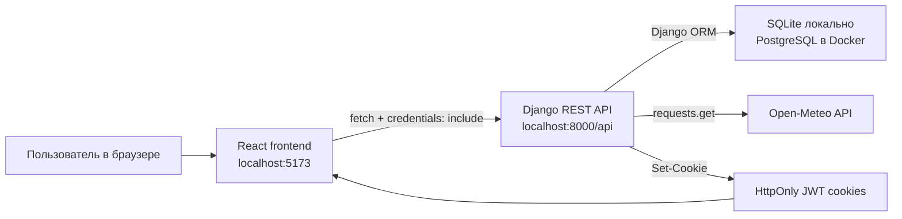

# PlantCare: разбор проекта для защиты

Этот документ нужен не для чтения кода построчно, а для уверенного ответа на
вопросы комиссии: что делает проект, почему выбран такой стек, как устроены
backend/frontend/БД, как работает авторизация, где защита от атак и что реально
показывает нагрузочное тестирование.

## 1. Короткий питч проекта

**PlantCare** — веб-сервис для ухода за домашними и балконными растениями.
Пользователь может:

- зарегистрироваться и войти в личный кабинет;
- смотреть каталог видов растений;
- добавлять свои растения;
- планировать задачи ухода: полив, удобрение, пересадка, обрезка;
- отмечать выполненный уход;
- объединять растения в коллекции;
- импортировать растения из CSV;
- получать погодную подсказку от Open-Meteo: температура, влажность, осадки
  сегодня/завтра и текстовый вывод вроде "скоро дождь", "дождя не будет",
  "влажность высокая".

Главная идея: это не просто CRUD, а маленькое прикладное приложение с личными
данными пользователя, расписанием ухода и внешней интеграцией.

## 2. Стек

| Часть | Технологии | Зачем |
| --- | --- | --- |
| Frontend | React 18, TypeScript, Vite, Material UI, React Hook Form, React Router | Быстрый SPA-интерфейс, типизация, готовые адаптивные компоненты, маршрутизация страниц |
| Backend | Python, Django 5.2, Django REST Framework | REST API, ORM, миграции, авторизация, сериализаторы, permissions |
| Auth | Django users + SimpleJWT + HttpOnly cookies | JWT-сессия без хранения токенов в `localStorage` |
| DB | SQLite локально, PostgreSQL в Docker | SQLite удобно для разработки; PostgreSQL ближе к реальному продакшену |
| API docs | drf-spectacular, Swagger UI | OpenAPI-схема и документация `/api/docs/` |
| Интеграция | Open-Meteo API | Погодные рекомендации по поливу |
| Тесты | pytest, pytest-django, coverage | Unit/API-проверки backend |
| Нагрузка | Locust | Имитация пользовательского сценария API |
| Запуск | Docker, Docker Compose, nginx для frontend | Воспроизводимый запуск frontend + backend + database |

### FastAPI или нет?

Нет, backend сделан на **Django + Django REST Framework**, не на FastAPI.

Как отвечать:

> Я выбрал Django REST Framework, потому что для такого проекта важны готовая
> модель пользователей, ORM, миграции, permissions, сериализаторы, админка и
> удобная работа с relational database. FastAPI тоже хороший вариант для REST,
> но в этом проекте DRF быстрее закрывает типовые задачи: авторизация,
> CRUD-ресурсы, связи моделей и OpenAPI через drf-spectacular.

## 3. Общая архитектура



Поток данных простой:

1. Пользователь открывает React-приложение.
2. Frontend вызывает backend через `fetch`.
3. Backend проверяет cookies/JWT, права доступа и валидирует данные через DRF.
4. Backend читает/пишет данные через Django ORM.
5. Для погодной карточки backend дополнительно обращается к Open-Meteo.
6. Frontend получает JSON и отрисовывает страницы.

## 4. Как запустить и что потыкать

### Через Docker

```bash
docker compose up --build
```

После запуска:

- frontend: http://localhost:5173
- backend API: http://localhost:8000/api/
- Swagger/OpenAPI: http://localhost:8000/api/docs/

### Локально без Docker

Backend:

```bash
python3 -m venv .venv
source .venv/bin/activate
pip install -r backend/requirements.txt
cd backend
python manage.py migrate
python manage.py seed_demo
python manage.py runserver
```

Frontend:

```bash
cd frontend
npm install
npm run dev
```

Что показать на защите руками:

1. Открыть каталог и показать плитки видов растений.
2. Зарегистрироваться или войти.
3. Добавить растение в "Мои растения".
4. Открыть карточку растения и показать погоду: температура, влажность, осадки,
   текстовая рекомендация.
5. Создать задачу ухода в календаре.
6. Отметить задачу выполненной и показать, что создается запись ухода.
7. В профиле создать коллекцию, переключить тему, импортировать CSV.
8. Открыть `/api/docs/` и показать, что API документируется автоматически.

## 5. Backend

Backend находится в `backend/`.

Ключевые файлы:

| Файл | За что отвечает |
| --- | --- |
| `backend/config/settings.py` | настройки Django, БД, CORS, JWT cookies, DRF |
| `backend/config/urls.py` | подключает `/api/`, `/api/schema/`, `/api/docs/`, admin |
| `backend/plantcare/models.py` | таблицы предметной области |
| `backend/plantcare/serializers.py` | преобразование моделей в JSON и валидация входных данных |
| `backend/plantcare/views.py` | API-ручки, permissions, бизнес-операции |
| `backend/plantcare/urls.py` | маршруты REST API |
| `backend/plantcare/authentication.py` | чтение JWT из HttpOnly cookie |
| `backend/plantcare/services.py` | работа с Open-Meteo и расчет рекомендации |
| `backend/plantcare/schema.py` | OpenAPI security scheme для cookie auth |
| `backend/plantcare/tests/` | тесты backend |

### Почему backend устроен через DRF ViewSet

Для основных сущностей используется `ModelViewSet`, потому что DRF сам дает
типовые CRUD-операции:

- `GET /resource/` — список;
- `POST /resource/` — создать;
- `GET /resource/{id}/` — получить одну запись;
- `PUT/PATCH /resource/{id}/` — обновить;
- `DELETE /resource/{id}/` — удалить.

Там, где нужна нестандартная операция, она сделана отдельным action или APIView:

- `POST /api/care-tasks/{id}/complete/` — выполнить задачу;
- `POST /api/import/plants/` — импорт CSV;
- `GET /api/weather/recommendation/` — погодная рекомендация;
- `/api/auth/*` — авторизация.

## 6. База данных

В проекте используются две СУБД в зависимости от режима:

- **SQLite** локально, если `POSTGRES_HOST` не задан. Это удобно для быстрой
  разработки: не нужно поднимать отдельный сервер БД.
- **PostgreSQL** в Docker Compose. Это основной вариант для демонстрации
  production-like запуска: отдельный контейнер `db`, healthcheck, volume для
  хранения данных.

Выбор сделан через `backend/config/settings.py`: если есть переменная
`POSTGRES_HOST`, Django подключается к PostgreSQL, иначе использует `db.sqlite3`.
Код приложения от этого не меняется, потому что все запросы идут через Django ORM.

### Основные таблицы

| Таблица/модель | Зачем нужна |
| --- | --- |
| `auth_user` | стандартные пользователи Django: username, email, password hash |
| `PlantSpecies` | справочник видов растений: название, латинское название, свет, влажность, интервал полива, картинка |
| `UserPlant` | конкретное растение пользователя: владелец, вид, nickname, место, заметки, последний полив |
| `CareTask` | будущие или текущие задачи ухода: полив, удобрение, пересадка, обрезка |
| `CareLog` | история уже выполненного ухода |
| `Collection` | пользовательская коллекция растений |
| `CollectionPlant` | связующая таблица many-to-many между коллекциями и растениями |

### Почему таблицы именно такие

`PlantSpecies` и `UserPlant` разделены специально:

- `PlantSpecies` — общий каталог. Например, "Сансевиерия" одна для всех.
- `UserPlant` — личный экземпляр. У разных пользователей могут быть свои
  растения одного вида, свои названия, заметки и даты полива.

`CareTask` и `CareLog` тоже разделены:

- `CareTask` — то, что нужно сделать;
- `CareLog` — то, что уже сделано.

Это удобно для календаря: задача может быть `pending`, `done` или `skipped`, а
история ухода остается отдельной лентой фактов.

`CollectionPlant` нужна, потому что это связь многие-ко-многим: одно растение
может быть в нескольких коллекциях, а одна коллекция содержит много растений.

### Ограничения целостности

В моделях есть важные ограничения:

- `PlantSpecies.name` уникален, чтобы не плодить одинаковые виды.
- `UserPlant` уникален по паре `(owner, nickname)`, чтобы у одного пользователя
  не было двух растений с одинаковым именем.
- `Collection` уникальна по паре `(owner, name)`, чтобы у пользователя не было
  двух коллекций с одинаковым названием.
- `CollectionPlant` уникальна по паре `(collection, plant)`, чтобы одно и то же
  растение не добавлялось в коллекцию дважды.
- У `UserPlant.species` стоит `on_delete=PROTECT`, чтобы нельзя было случайно
  удалить вид растения, если на него ссылаются растения пользователей.
- У пользовательских данных стоит `on_delete=CASCADE`: если удалить пользователя
  или его растение, связанные личные записи удаляются вместе с ним.

## 7. API-ручки

Актуальный список получен из OpenAPI-схемы командой:

```bash
../.venv/bin/python manage.py spectacular --file /tmp/plantcare-schema.yaml --validate
```

| Метод | URL | Доступ | Что делает |
| --- | --- | --- | --- |
| `POST` | `/api/auth/register/` | публично | регистрация пользователя |
| `POST` | `/api/auth/token/` | публично | login: проверяет username/password, ставит JWT cookies |
| `POST` | `/api/auth/token/refresh/` | публично, нужен refresh cookie | обновляет access cookie |
| `POST` | `/api/auth/logout/` | публично | удаляет auth cookies в браузере |
| `GET` | `/api/auth/me/` | auth | возвращает текущего пользователя |
| `GET` | `/api/species/` | публично | список видов растений |
| `GET` | `/api/species/{id}/` | публично | один вид растения |
| `GET` | `/api/plants/` | auth | список растений текущего пользователя |
| `POST` | `/api/plants/` | auth | создать растение текущего пользователя |
| `GET` | `/api/plants/{id}/` | auth | получить свое растение |
| `PUT/PATCH` | `/api/plants/{id}/` | auth | обновить свое растение |
| `DELETE` | `/api/plants/{id}/` | auth | удалить свое растение |
| `GET` | `/api/care-tasks/` | auth | список задач ухода текущего пользователя |
| `POST` | `/api/care-tasks/` | auth | создать задачу для своего растения |
| `GET/PUT/PATCH/DELETE` | `/api/care-tasks/{id}/` | auth | CRUD своей задачи |
| `POST` | `/api/care-tasks/{id}/complete/` | auth | отметить задачу выполненной и создать запись ухода |
| `GET` | `/api/care-logs/` | auth | история ухода текущего пользователя |
| `POST` | `/api/care-logs/` | auth | добавить запись ухода |
| `GET/PUT/PATCH/DELETE` | `/api/care-logs/{id}/` | auth | CRUD своей записи ухода |
| `GET` | `/api/collections/` | auth | список коллекций текущего пользователя |
| `POST` | `/api/collections/` | auth | создать коллекцию |
| `GET/PUT/PATCH/DELETE` | `/api/collections/{id}/` | auth | CRUD своей коллекции |
| `POST` | `/api/import/plants/` | auth | CSV-импорт растений |
| `GET` | `/api/weather/recommendation/` | auth | погодная рекомендация для своего растения |
| `GET` | `/api/schema/` | публично | OpenAPI schema |
| `GET` | `/api/docs/` | публично | Swagger UI |

## 8. Авторизация

Авторизация сделана через JWT, но токены не хранятся в `localStorage`.
Они лежат в **HttpOnly cookies**.

### Регистрация

Ручка:

```http
POST /api/auth/register/
```

Frontend отправляет:

```json
{
  "username": "user",
  "email": "user@example.com",
  "password": "password123"
}
```

Backend использует `RegisterSerializer`, создает пользователя через
`User.objects.create_user(...)`. Это важно: пароль сохраняется не открытым
текстом, а как Django password hash.

Регистрация сама по себе не ставит cookie. После успешной регистрации frontend
сразу вызывает login.

### Login

Ручка:

```http
POST /api/auth/token/
```

Что происходит:

1. Frontend вызывает `login(username, password)`.
2. В `frontend/src/api/client.ts` запрос идет через `fetch` с
   `credentials: "include"`.
3. Backend `CookieTokenObtainPairView` использует `TokenObtainPairSerializer`.
4. SimpleJWT проверяет username/password.
5. Backend создает refresh token и access token.
6. Backend кладет их в cookies через `Set-Cookie`.
7. В JSON frontend получает только `user` и `detail`, сами токены в тело ответа
   не возвращаются.

Cookies:

| Cookie | Для чего | Path | Lifetime | Флаги |
| --- | --- | --- | --- | --- |
| `plantcare_access` | основной access JWT для обычных API-запросов | `/` | 8 часов | `HttpOnly`, `SameSite=Lax`, `Secure` по env |
| `plantcare_refresh` | refresh JWT для продления сессии | `/api/auth/token/refresh/` | 7 дней | `HttpOnly`, `SameSite=Lax`, `Secure` по env |

Тонкая деталь: refresh cookie ограничен path
`/api/auth/token/refresh/`, поэтому браузер не отправляет refresh token на все
ручки подряд. Это уменьшает лишнее распространение более долгоживущего токена.

### Как backend понимает, кто пользователь

В `REST_FRAMEWORK.DEFAULT_AUTHENTICATION_CLASSES` стоит
`plantcare.authentication.CookieJWTAuthentication`.

Алгоритм:

1. Сначала backend пробует обычный `Authorization: Bearer ...`. Это полезно для
   Swagger, curl и внешних API-клиентов.
2. Если header нет, backend читает cookie `plantcare_access`.
3. SimpleJWT валидирует подпись и срок действия токена.
4. Из токена находится user.
5. Внутри view появляется `request.user`.

Если токена нет или он невалидный, приватные ручки отвечают `401 Unauthorized`.

### Проверка текущей сессии

Ручка:

```http
GET /api/auth/me/
```

Когда React-приложение открывается, `AuthProvider` вызывает `/auth/me/`.
Если cookie валидна, backend возвращает текущего пользователя, и frontend
считает пользователя авторизованным. Если ответ `401`, frontend считает, что
сессии нет.

### Refresh

Если обычный API-запрос получил `401`, `apiRequest` один раз вызывает:

```http
POST /api/auth/token/refresh/
```

На эту ручку браузер отправляет refresh cookie. Backend проверяет refresh token
и ставит новый access cookie. После этого frontend повторяет исходный запрос
один раз.

Почему один раз: чтобы не уйти в бесконечный цикл, если refresh тоже истек.

### Logout

Ручка:

```http
POST /api/auth/logout/
```

Backend отправляет `Set-Cookie` с истекшими cookies и тем самым просит браузер
удалить `plantcare_access` и `plantcare_refresh`.

Важная честная оговорка для защиты: сейчас logout удаляет cookies на клиенте,
но не заносит refresh token в server-side blacklist. Это нормально для учебного
MVP с HttpOnly cookies, но для production можно усилить:

- включить SimpleJWT blacklist app;
- включить rotation/blacklist refresh tokens;
- хранить серверные сессии или список отозванных токенов.

## 9. Защита от атак

### XSS и кража токенов

Что сделано:

- JWT не хранится в `localStorage`;
- access/refresh лежат в `HttpOnly` cookies;
- JavaScript на frontend не может прочитать cookie-токены через `document.cookie`;
- frontend хранит в `localStorage` только тему интерфейса.

Что это защищает:

- если на страницу попадет вредный JS, ему сложнее украсть токен как строку.

Что не защищает полностью:

- XSS все равно опасен: вредный JS может делать действия от имени пользователя
  через браузер, пока сессия активна. Поэтому нельзя считать HttpOnly полной
  защитой от XSS.

### CSRF

Что сделано:

- cookies имеют `SameSite=Lax`;
- CORS разрешает credentials только для `http://localhost:5173` и
  `http://127.0.0.1:5173`;
- `CORS_ALLOW_CREDENTIALS=True`, но не с wildcard-origin.

Как объяснить:

> Так как авторизация cookie-based, нужно думать про CSRF. В проекте риск
> снижен через `SameSite=Lax` и ограниченный CORS. Для учебного проекта этого
> достаточно, но для production я бы добавил явный CSRF-токен/double-submit
> схему или другой строгий механизм, потому что JWT-cookie auth не равен
> автоматической CSRF-защите Django sessions.

### IDOR: доступ к чужим объектам

IDOR — это когда пользователь угадывает чужой `id` и получает чужую запись.

Что сделано:

- `UserPlantViewSet.get_queryset()` фильтрует растения по `owner=request.user`;
- `CareTaskViewSet.get_queryset()` фильтрует задачи по `plant__owner`;
- `CareLogViewSet.get_queryset()` фильтрует логи по `plant__owner`;
- `CollectionViewSet` фильтрует коллекции по owner;
- при создании task/log проверяется, что `plant.owner == request.user`;
- в `CollectionSerializer` список `plant_ids` ограничен растениями текущего
  пользователя.

Практический эффект: если пользователь запросит `/api/plants/{id}/` для чужого
растения, DRF ищет объект только внутри его queryset и вернет 404, а не чужие
данные.

### SQL injection

Что сделано:

- запросы к БД идут через Django ORM;
- пользовательские значения не подставляются вручную в SQL-строки.

Это снижает риск SQL injection. Важная формулировка: ORM не отменяет
необходимость валидации данных, но в этом проекте нет ручного raw SQL, куда
можно было бы напрямую вставить пользовательский ввод.

### Password security

Что сделано:

- пользователь создается через `create_user`, поэтому пароль хранится как hash,
  а не открытым текстом;
- в serializer задан `min_length=8`.

Честная граница:

- Django password validators есть в settings, но serializer сейчас явно не
  вызывает `validate_password`. Для production лучше добавить эту проверку, чтобы
  отсеивать слишком распространенные или полностью числовые пароли.

### CORS

Что сделано:

- backend принимает credentialed-запросы только с заданных origins;
- список задается через `CORS_ALLOWED_ORIGINS`;
- wildcard `*` не используется вместе с cookies.

Это важно, потому что frontend и backend на разных портах:

- frontend: `localhost:5173`;
- backend: `localhost:8000`.

### HTTPS и Secure cookies

Локально `JWT_COOKIE_SECURE=0`, потому что приложение работает по HTTP.
В production нужно ставить:

```env
JWT_COOKIE_SECURE=1
DJANGO_DEBUG=0
DJANGO_SECRET_KEY=<strong-secret>
DJANGO_ALLOWED_HOSTS=<real-domain>
```

Тогда cookies будут отправляться только по HTTPS.

### Rate limiting

Сейчас rate limiting не реализован. Если спросят, отвечать так:

> В MVP защита от brute force ограничена стандартной проверкой пароля и
> коротким циклом авторизации, но полноценного rate limiting нет. Для production
> я бы добавил throttling DRF или reverse-proxy лимиты на `/api/auth/token/`,
> `/api/auth/register/` и импорт CSV.

## 10. Frontend

Frontend находится в `frontend/`.

Ключевые файлы:

| Файл | За что отвечает |
| --- | --- |
| `frontend/src/App.tsx` | маршруты и protected routes |
| `frontend/src/api/client.ts` | общий API-клиент, cookies, refresh-on-401 |
| `frontend/src/context/AuthContext.tsx` | состояние пользователя и методы signIn/signUp/signOut |
| `frontend/src/components/AppShell.tsx` | общий layout, навигация, logout |
| `frontend/src/pages/CatalogPage.tsx` | каталог видов растений |
| `frontend/src/pages/MyPlantsPage.tsx` | список и форма добавления растений |
| `frontend/src/pages/PlantDetailsPage.tsx` | карточка растения, погода, задачи, логи |
| `frontend/src/pages/CalendarPage.tsx` | календарь ухода и выполнение задач |
| `frontend/src/pages/ProfilePage.tsx` | коллекции, импорт CSV, тема |
| `frontend/src/pages/AuthPage.tsx` | login/register |

### ProtectedRoute

В `App.tsx` приватные страницы обернуты в `ProtectedRoute`:

- `/plants`;
- `/plants/:id`;
- `/calendar`;
- `/profile`.

Если пользователь не авторизован, frontend отправляет его на `/auth`.
Каталог и страница входа публичные.

### API-клиент

`apiRequest` делает несколько важных вещей:

1. Добавляет `Content-Type: application/json`, если body не `FormData`.
2. Всегда ставит `credentials: "include"`, чтобы браузер отправлял cookies.
3. Парсит JSON-ответ.
4. Если получил `401`, пытается refresh.
5. Повторяет исходный запрос один раз.
6. Если ошибка осталась, бросает понятный `Error`.

За счет этого страницы не думают о токенах. Они просто вызывают API.

### AuthContext

`AuthProvider` хранит:

- `user`;
- `isAuthenticated`;
- `loading`;
- `signIn`;
- `signUp`;
- `signOut`.

При старте приложения он вызывает `/auth/me/`, чтобы понять, есть ли активная
сессия в cookies.

## 11. Взаимодействие frontend и backend

Пример: пользователь добавляет растение.

1. Пользователь заполняет форму на странице "Мои растения".
2. Frontend отправляет:

```http
POST /api/plants/
```

3. Браузер автоматически прикладывает `plantcare_access` cookie.
4. Backend валидирует JWT и получает `request.user`.
5. `UserPlantViewSet.perform_create()` сохраняет растение с
   `owner=request.user`.
6. Backend возвращает JSON нового растения.
7. Frontend обновляет список растений.

Пример: пользователь выполняет задачу ухода.

1. Frontend вызывает:

```http
POST /api/care-tasks/{id}/complete/
```

2. Backend берет задачу из queryset текущего пользователя.
3. Ставит `status=done`.
4. Создает `CareLog`.
5. Если это полив, обновляет `plant.last_watered_at`.
6. Frontend перезагружает календарь/карточку и показывает актуальное состояние.

## 12. Погодная интеграция Open-Meteo

Ручка:

```http
GET /api/weather/recommendation/?plant_id=1&latitude=55.7558&longitude=37.6173
```

Если координаты не переданы, используются координаты Москвы:

- latitude `55.7558`;
- longitude `37.6173`.

Backend вызывает Open-Meteo:

```text
https://api.open-meteo.com/v1/forecast
```

Запрашиваются:

- текущая температура;
- относительная влажность;
- текущие осадки;
- сумма осадков сегодня;
- сумма осадков завтра.

Ответ backend для frontend:

| Поле | Значение |
| --- | --- |
| `should_water_today` | нужно ли поливать сегодня по логике сервиса |
| `next_watering_date` | ближайшая дата полива |
| `precipitation_mm` | осадки сегодня |
| `precipitation_tomorrow_mm` | осадки завтра |
| `temperature_c` | температура |
| `humidity_percent` | влажность |
| `rain_expected` | ожидается ли дождь сегодня/завтра |
| `weather_summary` | короткий текст: "скоро дождь", "дождя не ожидается" и т.д. |
| `message` | итоговая рекомендация с учетом типа растения |

Логика:

- для комнатного растения погода показывается как контекст, но решение о поливе
  в основном идет по графику;
- для балконного растения заметный дождь сегодня/завтра может отложить полив;
- высокая влажность и жара дают текстовые подсказки.

Если спросят, почему погода нужна даже комнатным растениям:

> Это демонстрирует внешнюю интеграцию и дает пользователю контекст. Для
> комнатного растения дождь напрямую не поливает грунт, но температура и
> влажность помогают понять, будет ли грунт сохнуть быстрее или медленнее.

## 13. CSV-импорт

Ручка:

```http
POST /api/import/plants/
Content-Type: multipart/form-data
```

Файл должен быть в поле `file`.

Минимальные колонки:

```csv
species_name,nickname,location_type,watering_interval_days,notes
Базилик,Кухня,balcony,2,Любит солнце
```

Обязательные поля:

- `species_name`;
- `nickname`.

Что делает backend:

1. Проверяет, что файл передан.
2. Читает CSV как UTF-8 с BOM-friendly режимом `utf-8-sig`.
3. Проверяет обязательные колонки.
4. По каждой строке ищет или создает `PlantSpecies`.
5. Создает `UserPlant` для текущего пользователя.
6. Возвращает `created_count`, список созданных растений и ошибки по строкам.

Тонкая деталь: импорт может создавать новые виды растений. Это удобно для
массового заполнения, но в production можно было бы ограничить создание видов
админом или модерацией.

## 14. OpenAPI и Swagger

Документация API доступна:

- `/api/schema/` — OpenAPI YAML/JSON schema;
- `/api/docs/` — Swagger UI.

`drf-spectacular` строит схему по DRF serializers/views.

Для cookie auth добавлен отдельный OpenAPI security scheme:

```text
cookieJwtAuth -> apiKey in cookie plantcare_access
```

Проверка схемы:

```bash
cd backend
../.venv/bin/python manage.py spectacular --file /tmp/plantcare-schema.yaml --validate
```

Свежий результат: команда завершилась успешно, endpoints из схемы извлеклись.

## 15. Тестирование

### Backend tests

Команда:

```bash
cd backend
../.venv/bin/python -m coverage run -m pytest
../.venv/bin/python -m coverage report
```

Свежий результат от 2026-06-03:

```text
15 passed in 1.90s
TOTAL 432 statements, 36 missed, 92% coverage
```

Что покрывают тесты:

- модели и расчет следующего полива;
- WeatherService и погодную рекомендацию;
- регистрацию/login/auth-доступ;
- приватность пользовательских данных;
- создание растений, задач, логов, коллекций;
- many-to-many коллекции;
- CSV-импорт;
- OpenAPI schema;
- поведение cookies/auth.

### Frontend build

Команда:

```bash
cd frontend
npm run build
```

Свежий результат:

```text
tsc -b && vite build
950 modules transformed
✓ built
```

Это проверяет, что TypeScript компилируется и production-сборка Vite собирается.

### Docker config

Команда:

```bash
docker compose config --quiet
```

Свежий результат: команда завершилась успешно, значит Compose-конфигурация
синтаксически валидна.

## 16. Нагрузочное тестирование

Нагрузка описана в `locustfile.py`.

Сценарий виртуального пользователя:

1. `on_start` регистрирует уникального пользователя.
2. Логинится через `/api/auth/token/`.
3. Загружает `/api/species/`.
4. Создает растение через `/api/plants/`.
5. Потом с весами выполняет задачи:
   - чаще открывает каталог;
   - открывает мои растения;
   - открывает календарь;
   - иногда создает запись ухода.

Команда свежего smoke-прогона:

```bash
./.venv/bin/python -m locust -f locustfile.py --host http://localhost:8000 --headless -u 1 -r 1 -t 5s --only-summary
```

Результат от 2026-06-03:

```text
Aggregated: 7 requests, 0 failures (0.00%)
Average response time: 63 ms
Min: 9 ms
Max: 198 ms
Median: 32 ms
Exit code: 0
```

По endpoint-ам:

| Endpoint | Requests | Failures |
| --- | ---: | ---: |
| `POST /api/auth/register/` | 1 | 0 |
| `POST /api/auth/token/` | 1 | 0 |
| `GET /api/species/` | 3 | 0 |
| `GET /api/plants/` | 1 | 0 |
| `POST /api/plants/` | 1 | 0 |

### Точно ли запуск правильно отработал?

Да, для smoke-нагрузки запуск корректный:

- Locust стартовал;
- поднял 1 виртуального пользователя;
- выполнил сценарий;
- все запросы получили успешные ответы;
- процесс завершился с `exit code 0`;
- summary показал `0(0.00%)` failures.

### Это полноценное production-нагрузочное тестирование?

Нет. Это **smoke load test**, то есть короткая проверка, что сценарий под
нагрузочным инструментом вообще работает.

Что он доказывает:

- API доступен;
- регистрация/login работают;
- cookies-сессия работает в Locust-клиенте;
- CRUD-сценарий не падает;
- базовые endpoints отвечают быстро в локальных условиях.

Что он не доказывает:

- что система выдержит сотни/тысячи пользователей;
- что база не упрется в connection pool;
- что не будет ошибок при долгом тесте;
- что production-сеть, HTTPS, reverse proxy и внешние сервисы выдержат нагрузку.

### Бывает ли в production 0% провалов?

Да, бывает на коротком спокойном прогоне или при нагрузке ниже лимитов системы.
Но на серьезном stress-тесте 0% failures не гарантируется и не является
универсальной нормой.

Правильный ответ:

> В моем запуске 0% failures означает, что конкретный короткий сценарий на
> локальном стенде отработал без ошибок. В production так тоже может быть, если
> нагрузка ниже емкости системы. Но при поиске предела обычно как раз ожидают,
> что после некоторого порога появятся ошибки или рост latency. Для полноценного
> вывода нужно гонять дольше, больше пользователей, смотреть p95/p99 latency,
> CPU, память, БД и логи.

Как усилить нагрузочное тестирование:

- увеличить пользователей, например `-u 50 -r 5 -t 10m`;
- добавить сценарии для weather, tasks, logs, collections;
- собрать CSV/HTML report Locust;
- смотреть p95/p99 latency, а не только среднее;
- мониторить CPU/RAM/PostgreSQL;
- запускать тест на Docker Compose или отдельном стенде.

## 17. Как проект закрывает требования

| Требование | Как выполнено |
| --- | --- |
| Frontend + backend + database | `frontend/`, `backend/`, SQLite/PostgreSQL |
| HTTP-взаимодействие | React вызывает REST API `/api/*` |
| Минимум 4 страницы | каталог, мои растения, карточка, календарь, профиль, авторизация |
| Минимум 3 формы | login/register, добавить растение, задача, запись ухода, коллекция, CSV |
| Списочное/плиточное отображение | каталог и мои растения отображаются плитками |
| JavaScript/TypeScript frontend | React + TypeScript |
| Backend на web framework | Django + Django REST Framework |
| Минимум 4 таблицы | PlantSpecies, UserPlant, CareTask, CareLog, Collection, CollectionPlant + auth_user |
| Комментарии в коде | есть в погодной логике и CSV-импорте |
| Unit/API tests | pytest/pytest-django |
| Coverage >75% | свежий результат 92% |
| OpenAPI | `/api/schema/`, `/api/docs/`, drf-spectacular |
| Many-to-many | Collection <-> UserPlant через CollectionPlant |
| Docker | backend/frontend Dockerfile, docker-compose.yml, PostgreSQL |
| Mobile layout | Material UI breakpoints, Drawer, responsive grids |
| Внешний сервис | Open-Meteo API |
| Авторизация | register/login/refresh/logout/me, JWT HttpOnly cookies |
| Нагрузочное тестирование | Locust smoke: 7 requests, 0 failures |
| Светлая/темная тема | переключатель темы в профиле |
| CSV/XML импорт | CSV-import через `/api/import/plants/` |

## 18. Частые вопросы и готовые ответы

### "Что делает проект?"

Это сервис ухода за растениями. Он помогает вести личный список растений,
планировать задачи ухода, отмечать выполненные действия, группировать растения в
коллекции и учитывать погоду для подсказок по поливу.

### "Почему не просто todo-list?"

Потому что есть предметная модель: виды растений, конкретные растения
пользователя, график полива, история ухода, коллекции, CSV-импорт и внешняя
погодная интеграция. Это уже domain-specific приложение, а не абстрактный список
задач.

### "Как работает авторизация?"

Пользователь логинится через `/api/auth/token/`. Backend проверяет пароль через
SimpleJWT/Django, создает access и refresh JWT и кладет их в HttpOnly cookies.
Frontend не читает токены, а просто отправляет запросы с `credentials: include`.
Backend достает access token из cookie, валидирует его и получает `request.user`.
Если access истек, frontend вызывает refresh endpoint и повторяет запрос.

### "Почему cookie лучше localStorage?"

HttpOnly cookie нельзя прочитать через JavaScript, поэтому при XSS сложнее
украсть сам токен. Но это не полная защита от XSS, потому что вредный JS все
равно может отправлять запросы от имени пользователя, пока сессия активна.

### "Есть ли защита от CSRF?"

Есть снижение риска: `SameSite=Lax`, ограниченный CORS и credentials только для
разрешенных origins. Для production я бы усилил это явным CSRF-токеном или
double-submit схемой, потому что cookie-based auth требует внимания к CSRF.

### "Как защищены чужие данные?"

Все личные viewset-ы фильтруют queryset по текущему пользователю. Например,
`/api/plants/` возвращает только `owner=request.user`. Для задач и логов
проверяется владелец растения. Поэтому пользователь не может получить или
изменить чужие растения простым подбором id.

### "Какая БД используется?"

Локально SQLite, в Docker PostgreSQL. SQLite выбран для простого локального
старта, PostgreSQL — как более реалистичная СУБД для контейнерного запуска.
Приложение использует Django ORM, поэтому бизнес-код не зависит от конкретной
СУБД.

### "Почему такие таблицы?"

Потому что разделены справочник и личные данные. `PlantSpecies` — общий вид,
`UserPlant` — растение конкретного пользователя. `CareTask` — запланированная
задача, `CareLog` — факт выполненного ухода. `Collection` и `CollectionPlant`
реализуют группировку растений через many-to-many.

### "Что происходит при выполнении задачи?"

`POST /api/care-tasks/{id}/complete/` находит задачу текущего пользователя,
ставит ей статус `done`, создает `CareLog`. Если тип задачи `water`, обновляет
`last_watered_at` у растения, чтобы следующий полив считался от новой даты.

### "Что делает погодная ручка?"

Она принимает `plant_id` и координаты, проверяет, что растение принадлежит
текущему пользователю, вызывает Open-Meteo, получает температуру, влажность и
осадки, затем строит рекомендацию. Для балконных растений дождь может отложить
полив, для комнатных погода остается контекстом.

### "Что если Open-Meteo недоступен?"

Сервис использует timeout 4 секунды и `raise_for_status()`. Если внешний API
упадет, запрос погоды завершится ошибкой, а frontend не должен ломать всю
карточку растения. Для production можно добавить cache, fallback-ответ и более
мягкую обработку ошибок на backend.

### "Что именно проверяло нагрузочное тестирование?"

Locust проверял короткий пользовательский API-сценарий: регистрация, login,
получение каталога, создание растения, чтение личных растений. Последний прогон:
7 запросов, 0 ошибок, среднее 63 ms. Это smoke-тест, а не доказательство
максимальной производительности.

### "0% ошибок в нагрузочном тесте — это нормально?"

Да, для короткого локального smoke-теста это нормально. Но в production на
длинном stress-тесте система может показать ошибки после достижения предела.
Нужно смотреть не только failures, но и latency p95/p99, ресурсы backend,
PostgreSQL и логи.

### "Какие главные слабые места и что улучшить?"

Честный список улучшений:

- включить `JWT_COOKIE_SECURE=1` и HTTPS в production;
- добавить явный CSRF-механизм для cookie auth;
- добавить rate limiting на login/register/import;
- включить blacklist/rotation refresh tokens;
- добавить `validate_password` в serializer регистрации;
- добавить cache/fallback для Open-Meteo;
- расширить Locust до долгого теста с большим числом пользователей;
- добавить мониторинг и structured logging.

## 19. Короткий сценарий ответа на защите

Можно начать так:

> Мой проект — PlantCare, сервис ухода за домашними и балконными растениями.
> Архитектурно это React + TypeScript frontend, Django REST Framework backend и
> база данных SQLite локально или PostgreSQL в Docker. Frontend общается с
> backend через REST API `/api/*`. Авторизация сделана через JWT в HttpOnly
> cookies: frontend не хранит токены в localStorage, а backend достает access
> token из cookie и определяет `request.user`. Личные данные защищены фильтрацией
> queryset по владельцу. В проекте есть каталог, растения пользователя, задачи
> ухода, история ухода, коллекции many-to-many, CSV-импорт и интеграция с
> Open-Meteo для погодных рекомендаций. Backend покрыт тестами: свежий прогон
> 15 passed, coverage 92%. Для нагрузки есть Locust smoke-сценарий: последний
> запуск дал 7 запросов и 0 ошибок, но это именно smoke, не доказательство
> бесконечной производительности.

